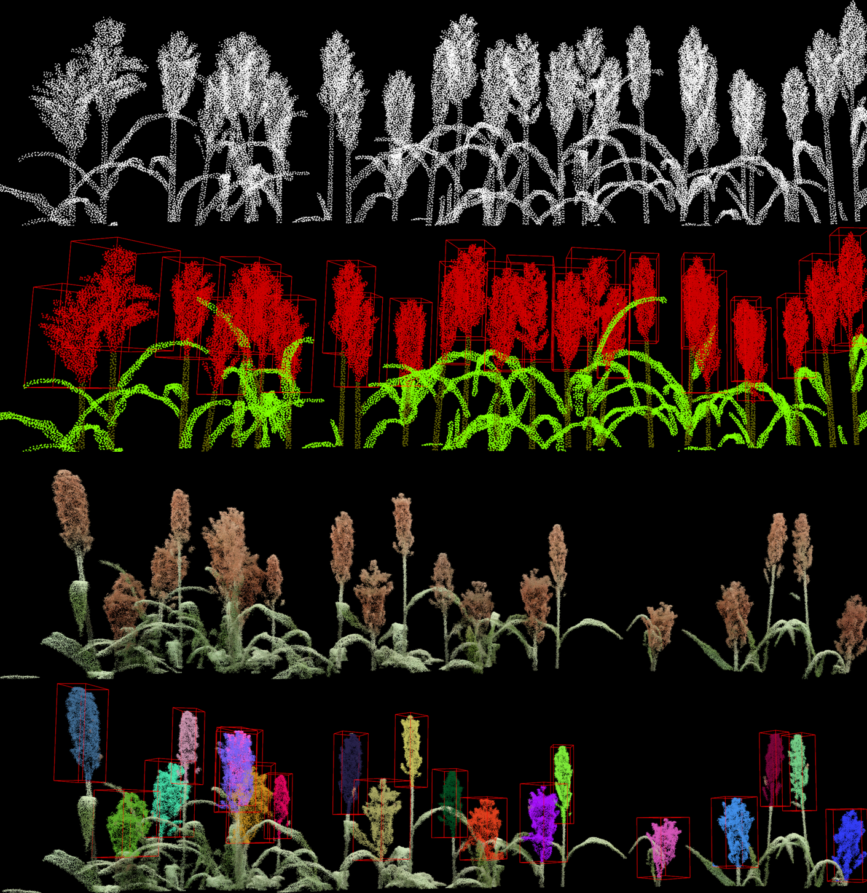

## SegVoteNet: Panicle Detection from Sorghum Canopy Point Clouds

This repository contains dataset samples and model checkpoints for **SegVoteNet**, a deep learning model designed for panicle detection from pure point clouds of sorghum canopies. A subset of the synthetic and real point cloud datasets from the experiments in the publication is made available for evaluation.

## Overview

SegVoteNet was developed with OpenMMLab's [MMDetection3D](https://github.com/open-mmlab/mmdetection3d) - an open source framework for 3D object detection based on PyTorch. Install dependencies and set up environment for MMDetection3D Version 1.4.0. Check installation guide [here](https://mmdetection3d.readthedocs.io/en/latest/get_started.html)

## Files
- `datasets/` 
	- `real/`: Subset of the synthetic point cloud dataset used for training model.
	- `synthetic/`: Real-world point cloud dataset from field experiments for model evaluation. 
	
- `model_chkpts/` - Pre-trained SegVoteNet model checkpoint.

## Network Modules
To Be Added

## Contact
Chrisbin (CJ) James: chris.james@uq.edu.au